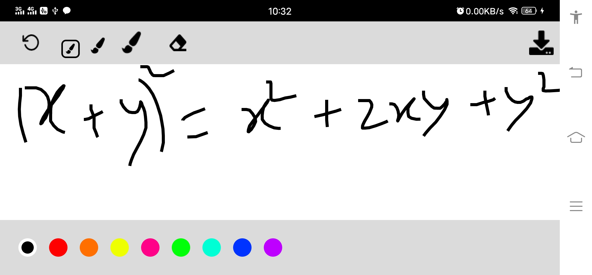
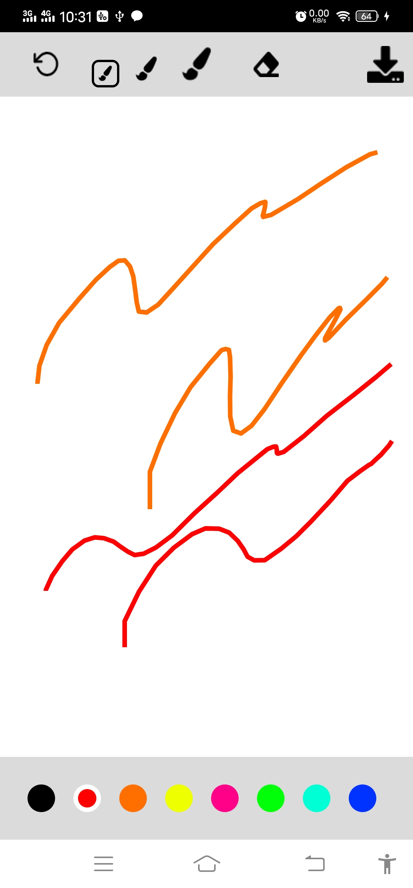
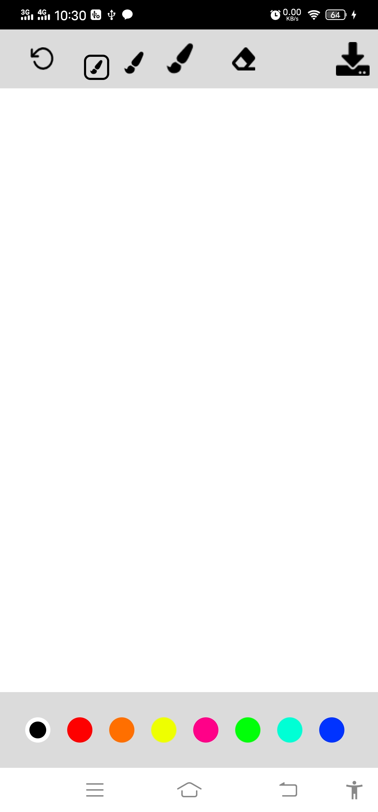
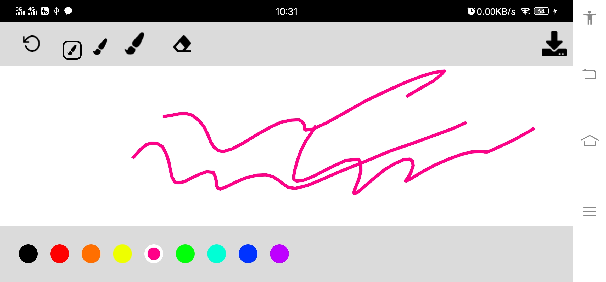

# PaintApp
simple painting or whiteboard app
## About
This is a simple whiteboard app for android platform where online classes can be taken. 

The key features are- 

<ul>
<li>Different colors for pen</li>

<li>Different sizes for pen</li>

<li>Eraser</li>

<li>Reset Board</li>
<li>Download image of the board at any moment</li>
<li>Landscape mode/>

</ul>

## Running the App
simply download the App and connect device in android studio and run the app.
